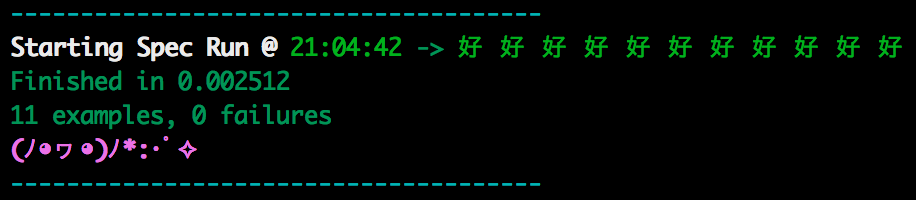

# Unassuming

An RSpec formatter to take up minimal space

## Why?
I find an RSpec + Guard workflow very useful when I'm developing, but find most of the default formatter too 'noisy' when I'm working in a single file.
This formatter helps by reducing the amount of information presented when encountering failures, while presenting enough information to see where the issue is.

###Passing Spec

###Failing Spec


## Installation

Add this line to your application's Gemfile:

```ruby
gem 'unassuming'
```

And then execute:

    $ bundle

## Usage

add to `.rspec`

```ruby
--format Unassuming
```

## Contributing

1. Fork it ( https://github.com/mfeckie/unassuming/fork )
2. Create your feature branch (`git checkout -b my-new-feature`)
3. Commit your changes (`git commit -am 'Add some feature'`)
4. Push to the branch (`git push origin my-new-feature`)
5. Create a new Pull Request
